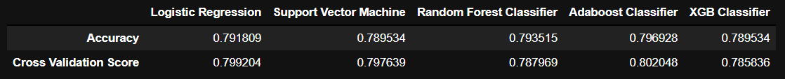

# Customer-Churn-Prediction

#### -- Project Status: [Active, On-Hold, Completed]
 

## Project Objective

Predict Customer Churn of a Telecom company to understand customer behavior and retain potentially leaving customers
&nbsp; &nbsp; &nbsp; &nbsp;

### Methods Used

* Machine Learning
* Data Visualization
* Predictive Modeling

&nbsp; &nbsp; &nbsp; &nbsp;

### License information

The work done in this project is made available under the Creative Commons Zero v1.0 Universal  License 

You are free to:

•	Share — copy and redistribute the material in any medium or format 
•	Adapt — remix, transform, and build upon the material. 

I have licensed this project for general public. The work done in this project is for learning and demonstration purposes. 
  
&nbsp; &nbsp; &nbsp; &nbsp;

## Libraries and Frameworks

•	Numpy – It provides a fast numerical array structure and operating functions.
 
 •	Pandas – It provides tools for data storage, manipulation and analysis tasks.
 
 •	Scikit-Learn – The standard machine learning library in Python.
 
 •  Matplotlib – It is the basic plotting library in Python, providing the necessary tools for plotting data.
 
 •  Seaborn – It is the advanced plotting library in Python. It provides clean and user friendly tools for making plots. 
 
 •  Pickle – It serializes the Machine Learning Model so that it need not be trained every time while in production. 
 
 &nbsp; &nbsp; &nbsp; &nbsp;
 
 ## Machine Learning models used :-
 
•  Logistic Regression 

•  Support Vector Machine

•  Random Forest Classifier

•  Adaboost Classifier

•  XGB Classifier
 
## Evaluation Metrics

* Accuracy - It is the proportion of correct predictions over total predictions

* Confusion Matrix - Confusion Matrix is a (2 x 2) table that has the values

[[True Positive   False Positive]
 [False Negative  True Negative]]
 
* k-fold Cross-Validation Score

Cross-validation is a resampling procedure used to evaluate machine learning models on a limited data sample. 
The general procedure is as follows:

1. Shuffle the dataset randomly.
2. Split the dataset into k groups
3. For each unique group:
  •  Take the group as a hold out or test data set
  •  Take the remaining groups as a training data set
  •  Fit a model on the training set and evaluate it on the test set
  •  Retain the evaluation score and discard the model
4. Summarize the skill of the model using the sample of model evaluation scores

##  Interpretation and Conclusion

The Adaboost Classifier has the best Accuracy score among all models analyzed of 0.793.   Adaboost Classifier also has the best Cross-Validation score of 0.802 among all models and hence, is both a <b>good fit</b> to the data and the **best suiting model** for this dataset.  

## References:

•  Machine Learning notes by Andrew Ng

•  Hands-On Machine Learning with Scikit-Learn, Keras, and TensorFlow by Aurélien Géron

•  https://www.python.org/

•  https://numpy.org/

•  https://pandas.pydata.org/

•  https://scikit-learn.org/stable/
